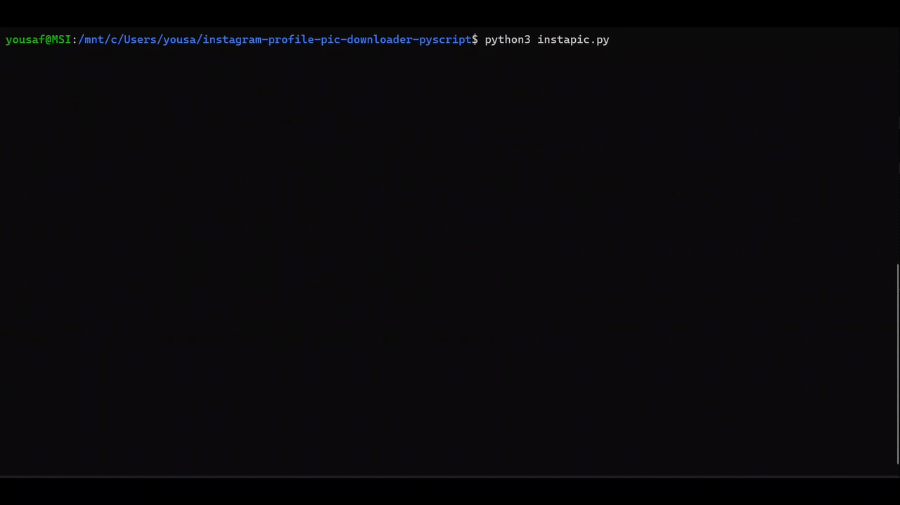

# Instagram DP Downloader with URL
[](https://travis-ci.org/joemccann/dillinger)

---
## Description
This is a simple python script for an Instagram profile pictures downloader. it's downloading dp to your machine locally and then it's generating a public URL of that the same profile picture. I know so many online websites are available for the same thing and all the websites have ads and captcha and it takes too much time so that's why I created this and it's just using educational purposes. 

----
## Feature
- Easy to download Instagram profile pictures with uploaded quality
- UserName and Copy link URL support
- Save DP to your system locally and generate a public URL.

----
## Pre-Requests
- python 3.x
- python3-pip

#### How to Install Python (for windows)
[Installation Guide](https://www.python.org/downloads/)

### Pre-Requests (for RedHat-Linux)
```
yum install -y git
yum install -y python3
yum install -y python3-pip
```

----
## Modules Used
- [requests](https://pypi.org/project/requests/)
- [json](https://docs.python.org/3/library/json.html)
- [base64](https://docs.python.org/3/library/base64.html)
- [os](https://docs.python.org/3/library/os.html)

---
## How to Get
```
git clone https://github.com/yousafkhamza/instagram-profile-pic-downloader-pyscript.git
cd instagram-profile-pic-downloader-pyscript
pip3 install -r requirements.txt
```

----
## How to execute
```
python3 instapic.py
```

----
## Output be like
```
# python3 instapic.py
Instagram Profile_URL/UserName: https://instagram.com/xxxxx?utm_medium=copy_link    # >>>>> use both URL and UserName
Image Downloaded under dp Directory!
Image URL Generating.....
Image URL is: https://i.ibb.co/xxxxx/xxxxxxx.jpg
```
_visual output_


----
## Behind the code
````
import requests
import json
import base64
import os

# URL Spliting.
insta_username= input('Instagram Profile_URL/UserName: ')
if insta_username.startswith("http"):
    if insta_username.endswith("/"):
        insta_username=insta_username.split(".com/")[1][:-1]
    elif insta_username.endswith("link"):
        insta_username=insta_username.split(".com/")[1].split("?")[0]
    else:
        insta_username=insta_username=insta_username.split(".com/")[1]
# Downloading path creation
if not os.path.exists("./dp"):
    os.makedirs("./dp")

# URL Imgbb API
key_imgbb="ab6f158359d0a96a54476b63d3529d31"          #public image generating imgbb key
insta_url='https://www.instagram.com'
response = requests.get(f"{insta_url}/{insta_username}/?__a=1")

# Main 
if response.ok:
    json_data = json.loads(response.text)
    profile_pic_url=json_data["graphql"]["user"]["profile_pic_url_hd"]
    r = requests.get(profile_pic_url, allow_redirects=True)
    print("Image Downloaded under dp Directory!")
    open(f"./dp/{insta_username}.jpeg", 'wb').write(r.content)
    print("Image URL Generating.....")
    with open(f"./dp/{insta_username}.jpeg", "rb") as file:
        url = "https://api.imgbb.com/1/upload"
        payload = {
            "key": key_imgbb,
            "image": base64.b64encode(file.read()),
            }
        r = requests.post(url, data= payload)
        view_url=(json.loads(r.text)["data"]["display_url"])
        print("Image URL is: "+view_url)
else:
    print("UserName/Profile URL isn't correct...")
````

----
## Conclusion
This is a python based script that is used to download Instagram profile pictures locally and it's generated an imgbb URL of that profile picture. 

### ⚙️ Connect with Me 

<p align="center">
<a href="mailto:yousaf.k.hamza@gmail.com"></a>
<a href="https://www.linkedin.com/in/yousafkhamza"></a> 
<a href="https://www.instagram.com/yousafkhamza"></a>
<a href="https://wa.me/%2B917736720639?text=This%20message%20from%20GitHub."></a><br />
